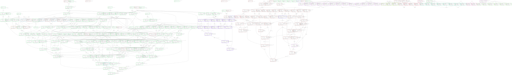

# satisfactory-sav-analyser

This tool was written in C++20 to assist with optimising a large factory in the game satisfactory, update 5.
It reads a save-file and the community Docs.json.
After parsing both, optionally outputting a json with most of the content of the save-file, it will study the topology of the factory.

It will apply several tricks to simplify the topology and output the result in a graphviz dot-file.
The dot-file can subsequently be transformed into a svg using the graphviz dot-tool.

_No effort has been done to make this userfriendly or clean._

How can this help?
- It becomes easy to discover buildings that are not or differently connected. (Think a single waterpipe in a row of 100 refineries is missing.)
- It becomes easy to count the amount of factory-buildings that do the work, without mixing them up with another group of buildings. 
  Even when the buildings are not connected to eachother, often the algorithm will figure out that they are basically the same, indirectly work towards the same goal and therefore should be grouped together as one node.  
  The count of factory-buildings is also relevant to load balancing: it is usually better to have an amount of factories that is only divisible by 2's and 3's. It is possible to distribute load over eg 5 factories but at the cost of bandwidth and simplicity.  
- The total clock speed per group is also calculated. This information can be placed besides the data from the [satisfactory-simulator](https://github.com/FDePourcq/satisfactorysimulator) to see wether there is sufficient production available or not for a particular demand.

Thanks to [Anthor with his satisfactory-calculator](https://github.com/AnthorNet/SC-InteractiveMap/blob/main/src/SaveParser/Read.js) and [Goz3rr with his satisfactory-save-editor](https://github.com/Goz3rr/SatisfactorySaveEditor) because without their work I wouldn't have been able to parse the sav.

